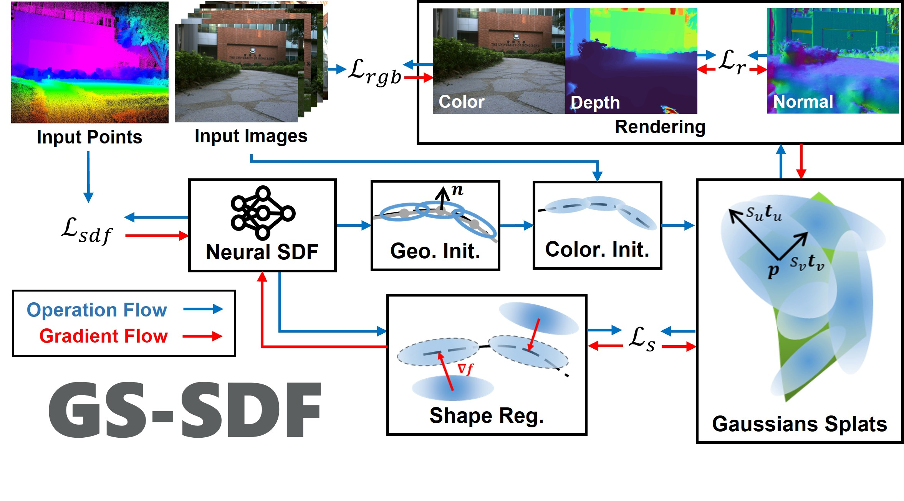

# GS-SDF: LiDAR-Augmented Gaussian Splatting and Neural SDF for Geometrically Consistent Rendering and Reconstruction

### ⭐ News
- 2026/02/03: Update [Custom FAST-LIVO2 Datasets](#44-custom-fast-livo2-datasets) for better adaption to general collection settings.
- 2025/08/09: Support colmap-format [Multi-camera datasets](#44-multi-camera-datasets).

## 1. Introduction


A unified LiDAR-visual system achieving geometrically consistent photorealistic rendering and high-granularity surface reconstruction.
We propose a unified LiDAR-visual system that synergizes Gaussian splatting with a neural signed distance field. The accurate LiDAR point clouds enable a trained neural signed distance field to offer a manifold geometry field. This motivates us to offer an SDF-based Gaussian initialization for physically grounded primitive placement and a comprehensive geometric regularization for geometrically consistent rendering and reconstruction.

Our paper is currently undergoing peer review. The code will be released once the paper is accepted.

[Project page](https://jianhengliu.github.io/Projects/GS-SDF/) | [Paper](https://arxiv.org/pdf/2503.10170) | [Video](https://youtu.be/w_l6goZPfcI)

## 2. Related paper

[GS-SDF: LiDAR-Augmented Gaussian Splatting and Neural SDF for Geometrically Consistent Rendering and Reconstruction](https://arxiv.org/pdf/2503.10170)

[FAST-LIVO2: Fast, Direct LiDAR-Inertial-Visual Odometry](https://arxiv.org/pdf/2408.14035)  

If you use GS-SDF for your academic research, please cite the following paper. 
```bibtex
@article{liu2025gssdflidaraugmentedgaussiansplatting,
      title={GS-SDF: LiDAR-Augmented Gaussian Splatting and Neural SDF for Geometrically Consistent Rendering and Reconstruction}, 
      author={Jianheng Liu and Yunfei Wan and Bowen Wang and Chunran Zheng and Jiarong Lin and Fu Zhang},
      journal={arXiv preprint arXiv:2108.10470},
      year={2025},
}
```

## 3. Installation

- Tested on Ubuntu 20.04, cuda 11.8
> The software not relies on ROS, but under ROS noetic installed, the installation should be easier.

### 自身でdockerイメージを作成する場合
```bash
  mkdir -p gs_sdf_ws/src
  cd gs_sdf_ws/src
  git clone http://tfsv.tasakilab:5051/git/tasaki/GS-SDF.git
  git clone http://tfsv.tasakilab:5051/git/tasaki/rviz_map_plugin.git
  git clone http://tfsv.tasakilab:5051/git/tasaki/rviz_fps_plugin.git
  cd GS-SDF/docker
  ./build-docker.sh
  ./run-docker.sh
  cd m2mapping_ws
  catkin_make -DENABLE_ROS=ON
  exit
```

### ビルド済みのdockerイメージを使う場合
```bash
  docker load < /t_data3/docker/ros1__GS.tar
  mkdir -p gs_sdf_ws/src
  cd gs_sdf_ws/src
  git clone http://tfsv.tasakilab:5051/git/tasaki/GS-SDF.git
  git clone http://tfsv.tasakilab:5051/git/tasaki/rviz_map_plugin.git
  git clone http://tfsv.tasakilab:5051/git/tasaki/rviz_fps_plugin.git 
  cd GS-SDF/docker
  ./run-docker.sh
  cd m2mapping_ws
  catkin_make -DENABLE_ROS=ON
  exit
```

## 4. Data Preparation

例えばReplicaデータセットならば
/home/data/mapping/Replica
のように/home/data/mappingの下にデータセットをダウンロードして配置してください。

- The processed FAST-LIVO2 Datasets and Replica Extrapolation Datasets are available at [M2Mapping Datasets](https://furtive-lamprey-00b.notion.site/M2Mapping-Datasets-e6318dcd710e4a9d8a4f4b3fbe176764)

### 4.1. Replica

- Download the Replica dataset from [M2Mapping Datasets](https://furtive-lamprey-00b.notion.site/M2Mapping-Datasets-e6318dcd710e4a9d8a4f4b3fbe176764) and unzip it to `src/GS-SDF/data`:
  ```bash
  wget https://cvg-data.inf.ethz.ch/nice-slam/data/Replica.zip
  # Replica.zip, cull_replica_mesh.zip, and replica_extra_eval.zip are supposed under gs_sdf_ws
  unzip -d src/GS-SDF/data Replica.zip
  unzip -d src/GS-SDF/data/Replica cull_replica_mesh.zip
  unzip -d src/GS-SDF/data replica_extra_eval.zip
  ```
- Arrange the data as follows:
  ```bash
  ├── Replica
  │   ├── cull_replica_mesh
  │   │   ├── *.ply
  │   ├── room2
  │   │   ├── eval
  │   │   │   └── results
  │   │   │   │   └── *.jpg
  │   │   │   │   └── *.png
  │   │   │   └── traj.txt
  │   │   └── results
  │   │   │   └── *.jpg
  │   │   │   └── *.png
  │   │   └── traj.txt
  ```

### 4.2. FAST-LIVO2 Datasets

- Download either Rosbag or Parsered Data in [M2Mapping Datasets](https://furtive-lamprey-00b.notion.site/M2Mapping-Datasets-e6318dcd710e4a9d8a4f4b3fbe176764).
- Arrange the data as follows:

  - For Rosbag:
    ```bash
    ├── data
    │   ├── FAST_LIVO2_Datasets
    │   ├── campus
    │   │   │   ├── fast_livo2_campus.bag
    ```
  - For Parsered Data:
    ```bash
    ├── data
    │   ├── FAST_LIVO2_Datasets
    │   │   ├── campus
    │   │   │   ├── images
    │   │   │   ├── depths
    │   │   │   ├── color_poses.txt
    │   │   │   ├── depth_poses.txt
    ```

### 4.3. Custom FAST-LIVO2 Datasets

- Clone the [modified-FAST-LIVO2](https://github.com/jianhengLiu/FAST-LIVO2) repo; install and run FAST-LIVO2 as the official instruction. The overall pipeline as:
  ```bash
  # 1. open a terminal to start LIVO
  roslaunch fast_livo mapping_avia.launch
  # 2. open another terminal to get ready for bag recording
  rosbag record /aft_mapped_to_init_lidar /aft_mapped_to_init_cam /origin_img/compressed /cloud_registered_body /tf /tf_static /path -O "fast_livo2_YOUR_DOWNLOADED" -b 4096 -O YOUR_BAG_NAME.bag
  # 3. open another terminal to play your downloaded/collected bag
  rosbag play YOUR_DOWNLOADED.bag
  # 4. convert rosbag into colmap format
  python scripts/rosbag_convert/rosbag_to_colmap.py \                       
    --bag_path data/YOUR_BAG_NAME.bag \--image_topic /origin_img/compressed \
    --image_pose_topic /aft_mapped_to_init_cam \
    --point_topic /cloud_registered_body \
    --point_pose_topic /aft_mapped_to_init_lidar \
    --output_dir data/YOUR_BAG_NAME_colmap \
    --fx [fx] --fy [fy] --cx [cx] --cy [cy] \
    --width [width] --height [height] \
    --k1=[k1] --k2=[k2] --p1=[p1] --p2=[p2]
  # 5. run GS-SDF with the converted colmap format data
  rosrun neural_mapping neural_mapping_node train src/GS-SDF/config/colmap/colmap_example.yaml data/YOUR_BAG_NAME_colmap
  ```

### 4.4. Multi-camera datasets

- Following [Colmap-txt-format](https://colmap.github.io/format.html) to prepare the multi-camera datasets as follows:
  ```bash
  ├── data
  │   ├── colmap_dataset
  │   │   ├── cameras.txt
  │   │   ├── images.txt
  │   │   ├── depths.txt
  │   │   ├── images/
  │   │   ├── depths/
  ```
  You can download the multi-camera demo datasets from [M2Mapping Datasets](https://furtive-lamprey-00b.notion.site/M2Mapping-Datasets-e6318dcd710e4a9d8a4f4b3fbe176764):
  ```bash
  rosrun neural_mapping neural_mapping_node train src/GS-SDF/config/colmap/shenzhenbei.yaml src/GS-SDF/data/multi_cam_demo_shenzhenbei_202404041751
  ```

## 5. Run
### コンテナの起動
```bash
  cd {$THIS_REPOSITORY}
  cd GS-SDF/docker
  ./run-docker.sh
  cd m2mapping_ws
  byobu
  roscore
```

### 各データセットで実行

#### Replicaの場合
```bash
    source devel/setup.bash # or setup.zsh

    # Replica
    rosrun neural_mapping neural_mapping_node train src/GS-SDF/config/replica/replica.yaml src/GS-SDF/data/Replica/room2
```
`src/GS-SDF/output`にplyファイルなどができていればOKです。
完全に出力が完了するまでそこそこ時間がかかります。
完全に出力が終わった後のターミナルで
`h`キーを押した後に `Enter`
を押すとhelpを見ることができます。

#### その他のデータセットの場合
(こちらは検証していません)
```bash
    # FAST-LIVO2 (ROS installed & ROS bag)
    ./src/GS-SDF/build/neural_mapping_node train src/GS-SDF/config/fast_livo/campus.yaml src/GS-SDF/data/FAST_LIVO2_RIM_Datasets/campus/fast_livo2_campus.bag
    # If ROS is installed, you can also run the following command:
    # rosrun neural_mapping neural_mapping_node train src/GS-SDF/config/fast_livo/campus.yaml src/GS-SDF/data/FAST_LIVO2_RIM_Datasets/campus/fast_livo2_campus.bag

    # FAST-LIVO2 (Parsered ROS bag format)
    ./src/GS-SDF/build/neural_mapping_node train src/GS-SDF/config/fast_livo/campus.yaml src/GS-SDF/data/FAST_LIVO2_RIM_Datasets/campus/color_poses.txt
    # If ROS is installed, you can also run the following command:
    # rosrun neural_mapping neural_mapping_node train src/GS-SDF/config/fast_livo/campus.yaml src/GS-SDF/data/FAST_LIVO2_RIM_Datasets/campus/color_poses.txt
```


For afterward visualization/evaluation, you can use the following command:

```bash
    source devel/setup.bash # or setup.zsh
    ./src/GS-SDF/build/neural_mapping_node view src/GS-SDF/output/(your_output_folder)
    # If ROS is installed, you can also run the following command:
    # rosrun neural_mapping neural_mapping_node view src/GS-SDF/output/(your_output_folder)
```


### 複数のデータセットを一度に実行したいときはこちら
(まだ試せていません)
  ```bash
      cd src/GS-SDF
      sh scripts/baseline.sh
  ```

## 6. Visualization

`src/GS-SDF/output`にplyファイルなどができていれば、rvizから好きな視点でレンダリングされた画像を確認できます。

- 起動したコンテナからbyobuで別ターミナルを起動して以下を実行してください。
  ```bash
  source devel/setup.bash # or setup.zsh
  roslaunch neural_mapping rviz.launch
  ```

- また別のターミナルで以下を実行してください。

  ```bash
  rosrun neural_mapping neural_mapping_node view src/GS-SDF/output/(your_output_folder)
  ```

  Click the `FPS Motion` button to enable FPS control, and you can use the `W`, `A`, `S`, `D` keys to move around the map. Drag the view to activate and control the view with the mouse.

## 7. Acknowledgement

Thanks for the excellent open-source projects that we rely on:
[gsplat](https://github.com/nerfstudio-project/gsplat), [M2Mapping](https://github.com/hku-mars/M2Mapping), [nerfacc](https://github.com/nerfstudio-project/nerfacc), [tiny-cuda-nn](https://github.com/NVlabs/tiny-cuda-nn), [kaolin-wisp](https://github.com/NVIDIAGameWorks/kaolin-wisp), [CuMCubes
](https://github.com/lzhnb/CuMCubes)
